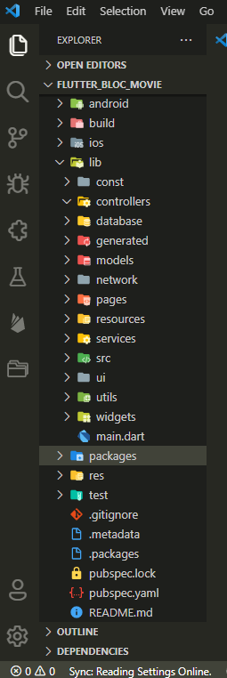
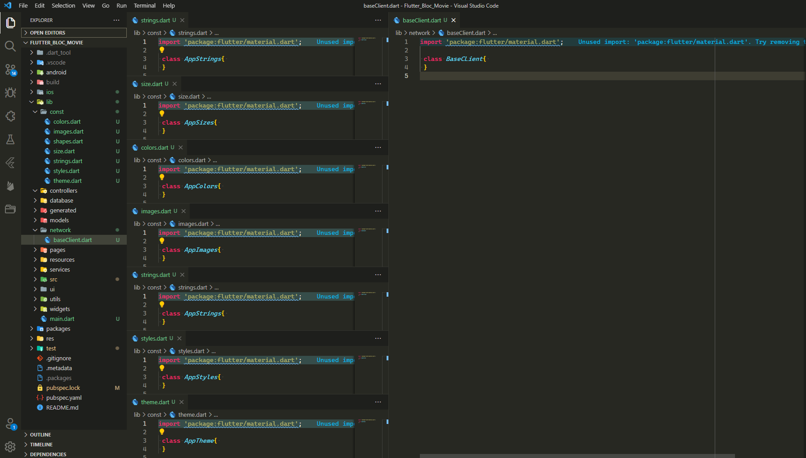
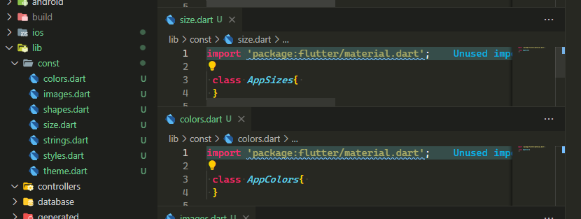

# flutter-project-directory README

Supports two different Project Structure as follows:

> 1 BLOC - see the release notes for folder structure. 
> 2 Normal - for provider see the snapshot 

If you want to add your own project structure to this extension kindly ping me on various platforms i have mentioned at the last.
> `Support me` 
> [Support this project by giving me cup of coffee](https://www.buymeacoffee.com/sanchitverma) 
> `Support me`

## Features

Create a Flutter Ready Directory. 
Create a BLOC supported project folders for easy files managing.

## These Snapshots are for normal project

### Screenshot of folders

## Screenshot of files

&nbsp;

## Requirements

This Extension requires VS Code to work.

## Release Notes

>This is third version. 
>Add folder for BLOC pattern creation. 
>These folders will be created in BLOC command:

1. `bloc` -: BLOC files
2. `config` -: all the configuration files like string,styles.images,etc.
3. `db` -: all the database related file which will communicate with local db in platform
4. `l10n` -: language translation
5. `models` -: all the models which are required in the application.
6. `repository` -: repo folder which will contains all the repo files which are used to decide from which source it has to fetch the data. For eg. local db, firebase, or server.
7. `screens` -: all the screens of the application are placed here.
8. `services` -: used for services like firebase communication, local database communication, permission handler,server communication,shared preference handler etc.
9. `widgets` -: all common widgets are placed here.
10. `packages` -: user defined library or packages can be placed here.

> `There are some file inside these folders which are also created for guide. check them by installing this extension and runing these two different commands:`

### To create this folder project structure type this

> `Ctrl`+`Shift`+`P`

### Then Run one of these.

>`FPD:: Create Folders for Flutter Project` 
>`FPD:: Create BLOC Folders for Flutter Project`

### 0.0.3

Initial release includes the project directory for the basic structure of flutter project.

---

### For more information

- [Visual Studio Code's Markdown Support](http://code.visualstudio.com/docs/languages/markdown)
- [Markdown Syntax Reference](https://heconsole.log.github.com/articles/markdown-basics/)

### Contact me

- [Facebook](https://facebook.com/sanchitverma168)
- [GitHub](https://github.com/sanchitverma168)
- [Twitter](https://twitter.com/sanchitverma168)
- [Instagram](https://www.instagram.com/sanchitverma168/)
- [Telegram](https://t.me/s168v)

[1]: http://google.com/ "Google"
[2]: http://search.yahoo.com/ "Yahoo Search"
[3]: http://search.msn.com/ "MSN Search"

**Enjoy!**
